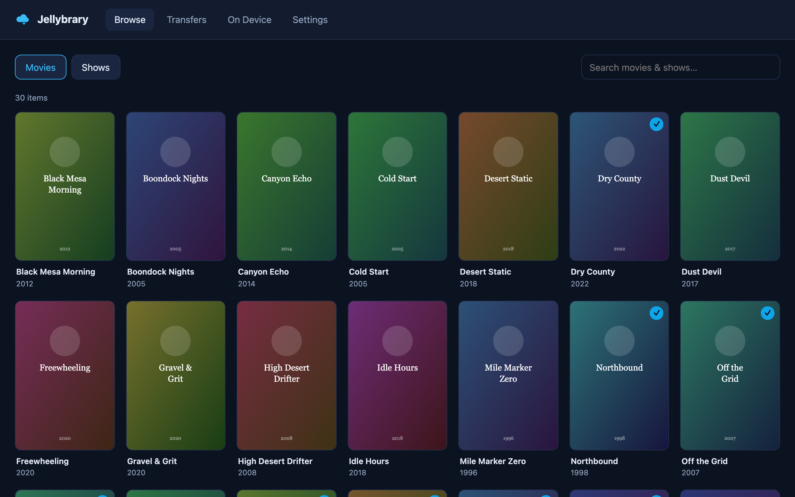

# Jellybrary

A bookmobile for your Jellyfin server: browse your primary (home) server, check media
out to a secondary mobile Jellyfin server (truck/RV) for off-grid use, and return it
when done. See [PLAN.md](PLAN.md) for the full design.

*Jellybrary is a community project, not affiliated with or endorsed by the
[Jellyfin](https://jellyfin.org) project.*


*(shown with the bundled mock library — your real posters appear with a real server)*

**Status: milestone 3** — browse the primary library, check out movies or whole series
at **original quality or as a 1080p/720p HEVC transcode** (with size estimates), watch
transfers with progress/resume, and return items to free space. Set the **Library
paths** in Settings so checkouts know where to land. Watch-state sync comes in
milestone 4.

Transcodes are performed by the *primary* Jellyfin server via its stream API, using
whatever hardware acceleration it has configured (Dashboard → Playback). Enable
"Allow encoding in HEVC format" there, or Jellyfin will fall back to H.264. Transcode
transfers are not resumable — an interrupted one restarts from zero.

## Requirements

- Node ≥ 22.13 (uses built-in `node:sqlite` and native TypeScript execution)
- A Jellyfin server + API key (Dashboard → API Keys)

## Run (dev)

```sh
npm install
npm run dev        # API on :3131, web UI on :5173
```

Open http://localhost:5173, go to Settings, enter your primary server URL + API key,
test the connection, pick a user, save.

No Jellyfin handy? Run the mock: `node tools/mock-jellyfin.mjs` (URL
`http://localhost:8097`, API key `mock`).

## Run (Docker — the intended deployment)

Runs on the **mobile** server, next to its Jellyfin:

```sh
docker compose up -d --build   # UI + API on :3131
```

Settings persist in `./data` (bind-mounted to `/data`). The container runs as the
`node` user (uid 1000), so make sure `./data` is writable by that uid. In milestone 2
you'll also mount the mobile Jellyfin's media folder — see the comment in
[docker-compose.yml](docker-compose.yml).

## Run (production-ish, no Docker)

```sh
npm run build      # builds web/dist, typechecks server
npm start          # serves API + built UI on :3131
```

Config lives in `data/jellybrary.db` (SQLite). Env vars: `JELLYBRARY_PORT`,
`JELLYBRARY_HOST`, `JELLYBRARY_DATA`.

## Layout

- `server/` — Fastify API: settings, Jellyfin proxy (browse, images)
- `web/` — Svelte 5 + Vite single-page UI
- `tools/mock-jellyfin.mjs` — tiny fake Jellyfin for development
